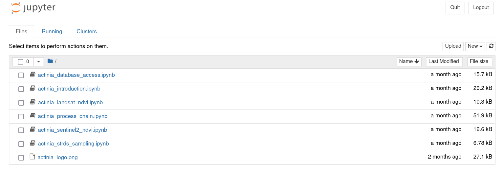
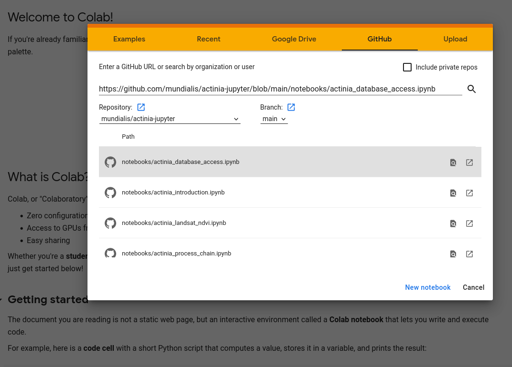

# actinia in jupyter notebooks

<center>

</center>

So far, examples used curl on the command line or a browser to interact with actinia. Another possibility is to create a Python script to interact with actinia. [Jupyter notebooks](https://jupyter.org/) are a convenient way to create Python scripts step-by-step.

The official [actinia tutorials](https://mundialis.github.io/actinia_core/) that also use curl commands have been converted to [jupyter notebooks](https://github.com/mundialis/actinia-jupyter)

## Getting started with jupyter notebooks

There are generally two ways to work with jupyter notebooks
* run a jupyter notebook on your local machine
* use jupyter hub where you can upload jupyter notebooks

### Running a jupyter notebook locally

Open a terminal in a folder with jupyter notebooks and start jupyter with

```bash
jupyter-notebook
```

This opens an instance in the default browser with a list of files:

<center>

</center>


### Using some jupyterhub

An example for a jupyterhub is [Google Colab](https://colab.research.google.com) where you can create, upload, and modify jupyter notebooks (a Google account is required). 

In Google Colab, you can also load a jupyter notebook directly from some Github repo:

<center>

</center>


## actinia jupyter notebooks

Ready to use jupyter notebooks for actinia based on the official tutorial are available on Github in the mundialis repo [actinia-jupyter](https://github.com/mundialis/actinia-jupyter). You can download this repo with e.g.

```bash
git clone https://github.com/mundialis/actinia-jupyter.git
```

Here we will use the following notebooks

* [Actinia database access](https://github.com/mundialis/actinia-jupyter/blob/main/notebooks/actinia_database_access.ipynb)
* [Time-series sampling](https://github.com/mundialis/actinia-jupyter/blob/main/notebooks/actinia_strds_sampling.ipynb)
* [User defined processing](https://github.com/mundialis/actinia-jupyter/blob/main/notebooks/actinia_process_chain.ipynb)

Ready to use Google Colab links:

* [Actinia database access](https://colab.research.google.com/github/mundialis/actinia-jupyter/blob/main/notebooks/actinia_database_access.ipynb)
* [Time-series sampling](https://colab.research.google.com/github/mundialis/actinia-jupyter/blob/main/notebooks/actinia_strds_sampling.ipynb)
* [User defined processing](https://colab.research.google.com/github/mundialis/actinia-jupyter/blob/main/notebooks/actinia_process_chain.ipynb)

Note that only a limited list of GRASS modules is allowed for the actinia demouser.
